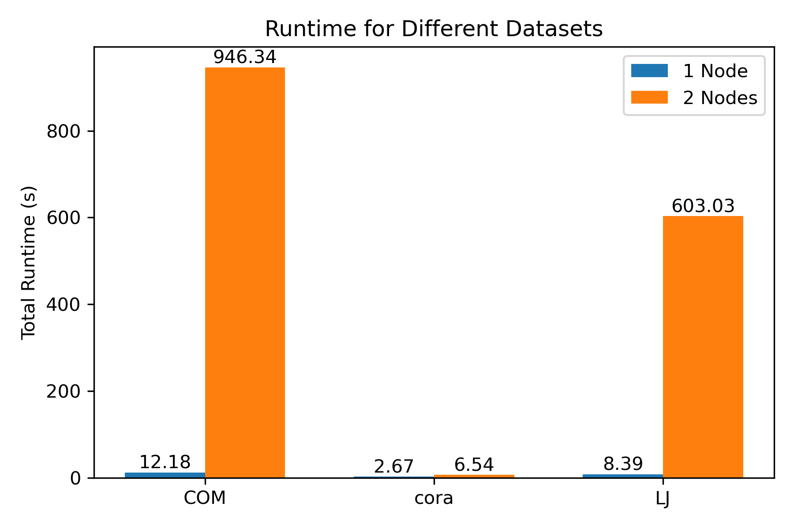
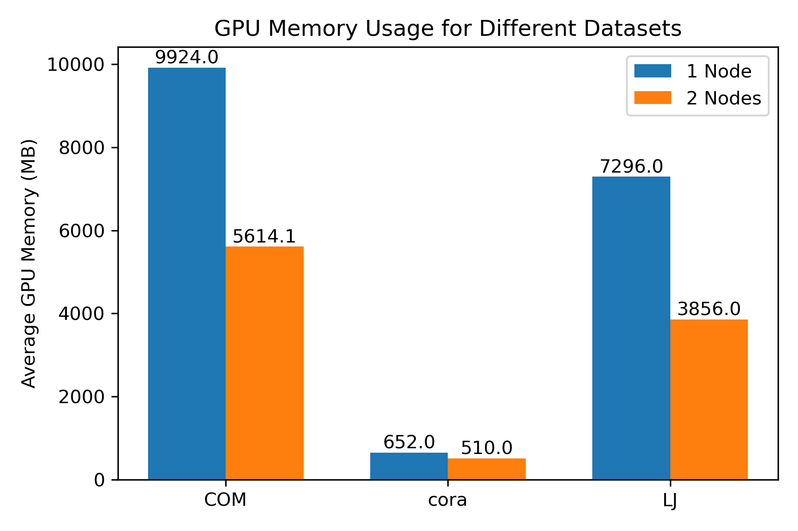

# [NeutronTP] 分布式实验总结分析报告

**报告日期：** 2025年09月12日
**小组成员：** 官忠宇

---

## 摘要

> 本实验旨在 [简要说明实验目的]。通过采用 [核心技术/架构，如微服务、Raft算法等] 构建了一个分布式系统，重点研究了 [核心关注点，如性能、一致性、容错性等]。实验结果表明，该系统能够 [陈述主要结果，如支持每秒XX请求，故障恢复时间为XX秒等]。分析发现，系统的性能瓶颈主要在于 [简要说明主要发现或瓶颈]。本次实验验证了 [分布式理论或技术] 的可行性，并为 [相关领域] 提供了实践参考。

---

## 1. 引言

### 1.1 实验目标
- 实验提供三个数据集cora, LiveJournal, ComOrkut:
    - 在单机 1 节点和分布式 2 节点的实验环境下记录运行时间，画出对应图表
    - 统计运行过程中的CPU/GPU内存使用情况
    - 写总结报告，给出实验分析

## 2. 实验设计与环境

### 2.1 实验步骤
1.  启动 NTP 虚拟环境，确保 spmm 安装成功
2.  本实验禁用IB，服务器采用TCP通信
3.  prepare_data.py 实现对数据集的分区
4.  main.py中修改命令行参数，尤其是 2 节点--node_rank == 1参数，表明是几号机器
5. 若搭建好NFS，可以使用Filestore实现服务器之间的数据共享，自动统计并计算时间和GPU内存使用情况

## 3. 实验过程与结果

### 3.1 实验数据记录

#### 3.1.1 cora数据集

**表 3-1: cora数据集 1 节点操作耗时统计**
```
timer summary:
  0.09s   0.09s     1 broadcast
  0.15s   0.15s     1 spmm
  0.27s   0.27s     1 mm
  0.04s   0.04s     1 all_reduce
  0.63s   0.63s     1 epoch
  2.67s   2.67s     1 total
```

**表 3-2: cora数据集 2 节点操作耗时统计**
```
timer summary:
  3.41s   0.56s     1 broadcast
  0.18s   0.01s     1 spmm
  0.29s   0.04s     1 mm
  0.32s   0.13s     1 all_reduce
  4.27s   0.37s     1 epoch
  6.54s   0.00s     1 total
```

**表 3-3: cora数据集 1 节点gpu内存使用统计**
```
GPU Memory Summary:
============================================================
全局平均内存使用率: 2.0%
全局峰值内存使用率: 2.0%
全局平均内存使用量: 652.0 MB
全局峰值内存使用量: 652.0 MB
------------------------------------------------------------
Rank 0: 平均 2.0% (652.0 MB), 峰值 2.0% (652.0 MB), 样本数 20
============================================================
```

**表 3-4: cora数据集 2 节点gpu内存使用统计**
```
GPU Memory Summary:
============================================================
全局平均内存使用率: 1.6%
全局峰值内存使用率: 1.6%
全局平均内存使用量: 510.0 MB
全局峰值内存使用量: 510.0 MB
------------------------------------------------------------
Rank 0: 平均 1.6% (510.0 MB), 峰值 1.6% (510.0 MB), 样本数 20
Rank 1: 平均 1.6% (510.0 MB), 峰值 1.6% (510.0 MB), 样本数 20
============================================================
```

**表 3-5: LJ数据集 1 节点操作耗时统计**
```
timer summary:
  0.08s   0.08s     1 broadcast
  0.70s   0.70s     1 spmm
  0.64s   0.64s     1 mm
  0.03s   0.03s     1 all_reduce
  2.71s   2.71s     1 epoch
  8.39s   8.39s     1 total
```

**表 3-6: LJ数据集 2 节点操作耗时统计**
```
timer summary:
593.02s   3.14s     1 broadcast
  0.72s   0.36s     1 spmm
  0.45s   0.01s     1 mm
  2.74s   3.68s     1 all_reduce
597.62s   0.17s     1 epoch
603.03s   0.01s     1 total
```

**表 3-7: LJ数据集 1 节点gpu内存使用统计**
```
GPU Memory Summary:
============================================================
全局平均内存使用率: 22.3%
全局峰值内存使用率: 22.3%
全局平均内存使用量: 7296.0 MB
全局峰值内存使用量: 7296.0 MB
------------------------------------------------------------
Rank 0: 平均 22.3% (7296.0 MB), 峰值 22.3% (7296.0 MB), 样本数 20
============================================================
```

**表 3-8: LJ数据集 2 节点gpu内存使用统计**
```
GPU Memory Summary:
============================================================
全局平均内存使用率: 11.8%
全局峰值内存使用率: 11.8%
全局平均内存使用量: 3856.0 MB
全局峰值内存使用量: 3864.0 MB
------------------------------------------------------------
Rank 0: 平均 11.8% (3864.0 MB), 峰值 11.8% (3864.0 MB), 样本数 20
Rank 1: 平均 11.7% (3848.0 MB), 峰值 11.7% (3848.0 MB), 样本数 20
============================================================
```

**表 3-9: COM数据集 1 节点操作耗时统计**
```
timer summary:
  0.04s   0.04s     1 broadcast
  1.44s   1.44s     1 spmm
  0.77s   0.77s     1 mm
  0.03s   0.03s     1 all_reduce
  3.95s   3.95s     1 epoch
 12.18s  12.18s     1 total
```

**表 3-10: COM数据集 2 节点操作耗时统计**
```
timer summary:
933.89s   0.29s     1 broadcast
  0.86s   0.77s     1 spmm
  0.52s   0.00s     1 mm
  3.00s   3.98s     1 all_reduce
939.18s   2.92s     1 epoch
946.34s   0.00s     1 total
```

**表 3-11: COM数据集 1 节点gpu内存使用统计**
```
GPU Memory Summary:
============================================================
全局平均内存使用率: 30.3%
全局峰值内存使用率: 30.3%
全局平均内存使用量: 9924.0 MB
全局峰值内存使用量: 9924.0 MB
------------------------------------------------------------
Rank 0: 平均 30.3% (9924.0 MB), 峰值 30.3% (9924.0 MB), 样本数 20
============================================================
```

**表 3-12: COM数据集 2 节点gpu内存使用统计**
```
GPU Memory Summary:
============================================================
全局平均内存使用率: 17.1%
全局峰值内存使用率: 24.7%
全局平均内存使用量: 5614.1 MB
全局峰值内存使用量: 8078.0 MB
------------------------------------------------------------
Rank 0: 平均 17.5% (5732.1 MB), 峰值 24.7% (8078.0 MB), 样本数 20
Rank 1: 平均 16.8% (5496.1 MB), 峰值 23.9% (7842.0 MB), 样本数 20
============================================================
```

### 3.2 数据图表展示



**图 3-1: 不同节点运行时间条形图**

---



**图 3-2: 不同节点GPU内存使用情况条形图**

---

## 4. 分析与讨论

### 4.1 结果解读

三个数据集的测试结果具有相似性，以COM数据为例展开说明。

基于表3-9至表3-12的实验数据，可以得出以下关键发现：
1. 扩展性能表现

从单节点扩展到双节点架构后，出现了显著的性能异常。表3-9显示单节点总耗时为12.18秒，而表3-10显示双节点总耗时激增至946.34秒，性能反而下降了约77倍。这种性能退化主要源于broadcast操作的异常耗时（933.89秒），表明在双节点环境下通信开销成为主要瓶颈。

---

2. 计算操作的效率对比
    1. spmm操作在双节点下耗时减少（1.44s -> 0.86s），显示了一定的计算并行效益
    2. mm操作耗时也有所降低（0.77s -> 0.52s），证明矩阵乘法操作具有良好的并行性
    3. all_reduce操作耗时增加（0.03s -> 3.00s），反映了跨节点通信的固有开销

---

3. 内存使用效率
双节点架构显著改善了GPU内存利用率：
    1. 单节点内存使用率30.3%，峰值9924.0 MB
    2. 双节点平均使用率降至17.1%，峰值8078.0 MB，实现了更好的内存负载均衡
    3. Rank 0和Rank 1的内存使用分布相对均衡（5732.1 MB vs 5496.1 MB）

---

### 4.2 局限性
1. 通信瓶颈突出

实验结果显示广播操作成为系统主要瓶颈，表明当前采用的通信策略可能不是最优的。  

推测可能原因：未安装NFS，可能对双节点的TCP通信造成一定影响

2. 硬件配置约束​

实验采用的2节点配置规模较小，无法充分验证系统在大规模集群下的扩展性特征。
而且，网络连接的性能特征可能对结果产生重大影响。TCP连接收到网络不稳定因素影响较大。

## 5. 结论

### 5.1 实验总结

本研究通过系统性地对比cora、LJ和COM三个数据集在单节点和双节点环境下的性能表现，得出以下重要结论：

1. 数据集规模对分布式性能影响显著​
    - 小规模数据集（cora）​​：双节点架构虽然带来了1.6倍的内存使用优化，但由于通信开销占比增加，总训练时间从2.67s增加到6.54s，性能下降约2.4倍
    - 中规模数据集（LJ）​​：双节点下内存使用减少约47%（7296MB→3856MB），但广播操作耗时激增（0.08s→593.02s），总训练时间从8.39s恶化到603.03s
    - 大规模数据集（COM）​​：展现出最明显的内存优化效果，内存使用减少43%（9924MB→5614MB），但同样受广播操作影响（0.04s→933.89s），总耗时从12.18s增加到946.34s

2. 通信瓶颈成为分布式训练的主要瓶颈

在所有数据集的分布式实验中，广播操作均成为系统性能的主要瓶颈，且随着数据集规模的增大，通信开销呈指数级增长趋势，这表明当前的通信架构无法有效支持分布式图神经网络训练。

3. 内存优化效果显著​

双节点架构在所有实验中都成功实现了内存负载的均衡分布，各节点的内存使用率显著降低，证明了分布式系统在资源利用率方面的固有优势。

### 5.2 主要收获

技术层面收获：
1. 当前采用的广播算法完全无法满足分布式GNN训练需求，必须采用更高效的通信方法或梯度压缩技术
2. 实验显示只有当计算开销远大于通信开销时，分布式架构才能发挥优势，这为算法设计提供了重要指导原则
3. 本实验熟悉了分布式系统架构运行流程，通信方式，具备的优点以及面临的挑战
